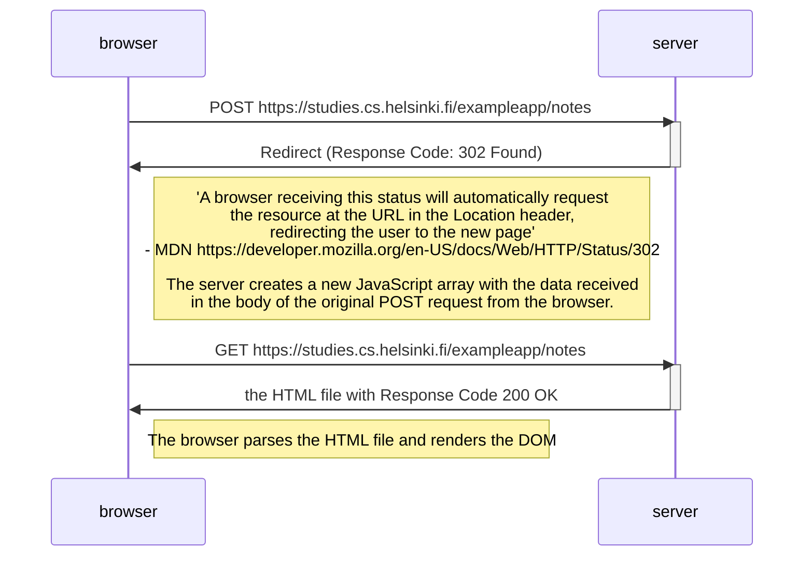

# 0.4_new-note-diagram

```mermaid
sequenceDiagram
  participant browser
  participant server

  browser->>server: POST https://studies.cs.helsinki.fi/exampleapp/notes
  activate server
  server->>browser: Redirect (Response Code: 302 Found)
  deactivate server

  Note left of server: 'A browser receiving this status will automatically request<br> the resource at the URL in the Location header, <br>redirecting the user to the new page'<br>- MDN https://developer.mozilla.org/en-US/docs/Web/HTTP/Status/302 <br><br> The server creates a new JavaScript array with the data received<br> in the body of the original POST request from the browser.

  browser->>server: GET https://studies.cs.helsinki.fi/exampleapp/notes
  activate server
  server->>browser: the HTML file with Response Code 200 OK
  deactivate server

  Note right of browser: The browser parses the HTML file and renders the DOM
```
