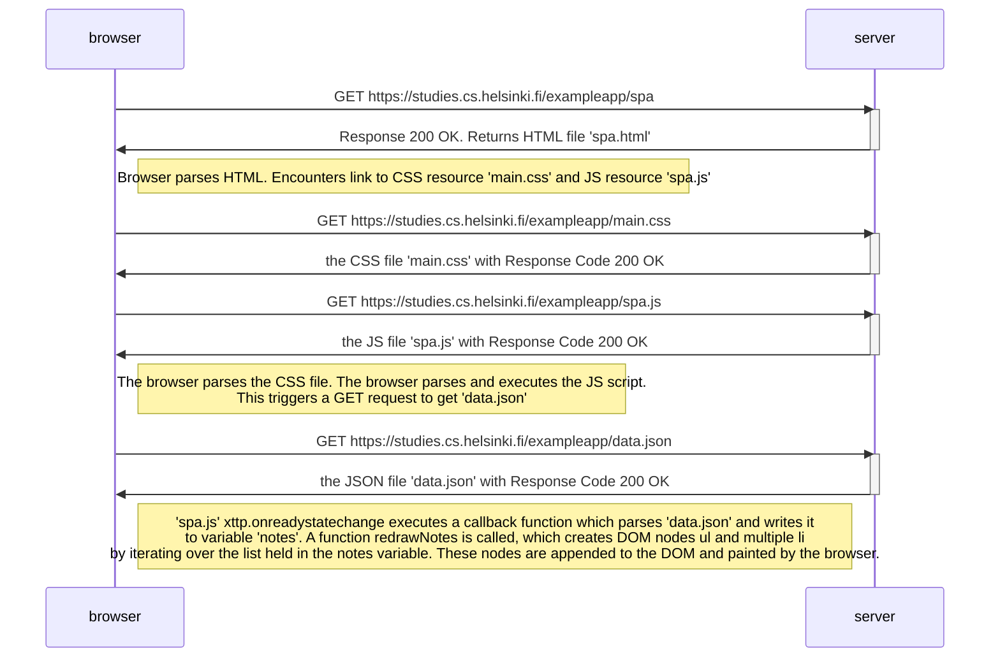

# 0.4_new-note-diagram

```mermaid
sequenceDiagram
  participant browser
  participant server

  browser->>server: GET https://studies.cs.helsinki.fi/exampleapp/spa
  activate server
  server->>browser: Response 200 OK. Returns HTML file 'spa.html'
  deactivate server

  Note right of browser: Browser parses HTML. Encounters link to CSS resource 'main.css' and JS resource 'spa.js'

  browser->>server: GET https://studies.cs.helsinki.fi/exampleapp/main.css
  activate server
  server->>browser: the CSS file 'main.css' with Response Code 200 OK
  deactivate server

  browser->>server: GET https://studies.cs.helsinki.fi/exampleapp/spa.js
  activate server
  server->>browser: the JS file 'spa.js' with Response Code 200 OK
  deactivate server

  Note right of browser: The browser parses the CSS file. The browser parses and executes the JS script. <br> This triggers a GET request to get 'data.json'

  browser->>server: GET https://studies.cs.helsinki.fi/exampleapp/data.json
  activate server
  server->>browser: the JSON file 'data.json' with Response Code 200 OK
  deactivate server

  Note right of browser: 'spa.js' xttp.onreadystatechange executes a callback function which parses 'data.json' and writes it<br> to variable 'notes'. A function redrawNotes is called, which creates DOM nodes ul and multiple li <br>by iterating over the list held in the notes variable. These nodes are appended to the DOM and painted by the browser.
```
