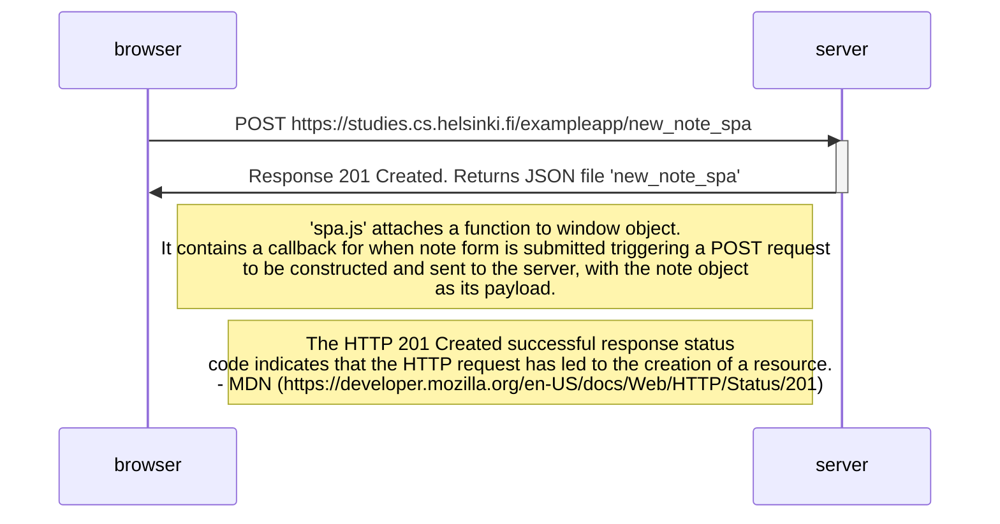

# 0.4_new-note-diagram

```mermaid
sequenceDiagram
  participant browser
  participant server

  browser->>server: POST https://studies.cs.helsinki.fi/exampleapp/new_note_spa
  activate server
  server->>browser: Response 201 Created. Returns JSON file 'new_note_spa'
  deactivate server

  Note right of browser: 'spa.js' attaches a function to window object.<br> It contains a callback for when note form is submitted triggering a POST request<br> to be constructed and sent to the server, with the note object<br> as its payload.

  Note left of server: The HTTP 201 Created successful response status <br>code indicates that the HTTP request has led to the creation of a resource.<br> - MDN (https://developer.mozilla.org/en-US/docs/Web/HTTP/Status/201)
```
